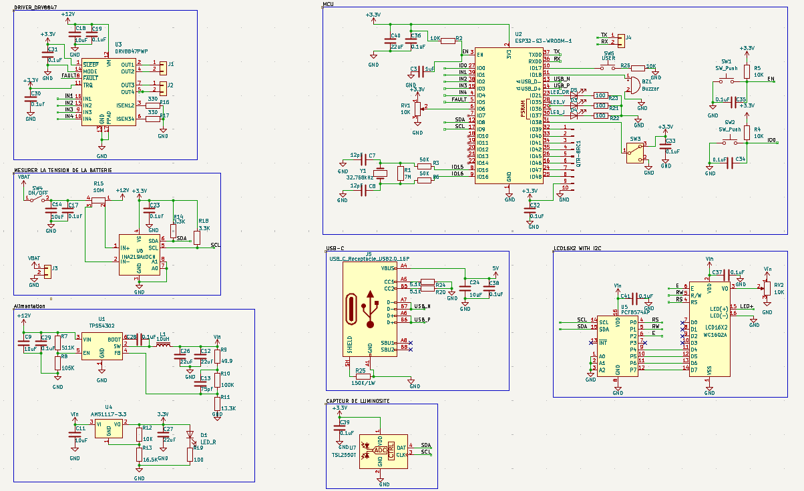

# DualMode-Robot-ESP32S3-PCB

Custom ESP32-S3 based robot controller PCB designed for a dual-mode mobile robot capable of autonomous line following and Bluetooth manual control.

---

# Description

Conception du schéma électronique d’une carte de contrôle pour robot mobile réalisée sous KiCad.  
Le projet est basé sur un microcontrôleur ESP32-S3 avec Bluetooth intégré et comprend :

- Contrôle de moteurs DC
- Suivi de ligne avec capteurs infrarouges
- Gestion d’alimentation embarquée
- Mesure de courant et tension batterie
- Interface USB-C native

Le projet est actuellement au stade de conception schématique.

---

# Architecture de la carte

La carte est divisée en plusieurs blocs fonctionnels :

---

## Microcontrôleur

- ESP32-S3-WROOM-1
- Bluetooth natif intégré
- Contrôle principal du robot
- Interfaces utilisées :
  - GPIO
  - PWM
  - I2C
  - USB OTG

---

## Capteurs de suivi de ligne

- 6 × TCRT5000
- Détection ligne noire / fond blanc
- Lecture des données par l’ESP32-S3
- Placement prévu à l’avant du robot

---

## Contrôle moteurs

- 2 × DRV8847PWP
- Contrôle de 4 moteurs DC
- Pilotage PWM
- Sélection du mode :
  - AUTONOME
  - MANUEL (Bluetooth)

---

## Alimentation

- Entrée batterie 12V
- TPS54302DDCR :
  - Conversion 12V → 5V
- AMS1117-3.3 :
  - Conversion 5V → 3.3V
- INA219 :
  - Mesure courant/tension batterie
- LEDs d’état d’alimentation

---

## Interfaces utilisateur

- USB-C pour programmation
- Bouton ON/OFF
- Bouton USER
- Buzzer
- LCD I2C

---

# Caractéristiques techniques

- Microcontrôleur : ESP32-S3-WROOM-1
- Tension principale : 12V
- Tension logique : 3.3V
- Contrôle moteur : PWM
- Communication : Bluetooth / I2C / USB
- Conception réalisée pour soudure manuelle
- Footprints minimum : 0805

---

# Outils utilisés

- KiCad
- SnapMagic
- Arduino IDE / PlatformIO

---

# État du projet

| Partie | Statut |
|---|---|
| Schématique | ✅ En cours |
| Routage PCB | ⏳ Pas commencé |
| PCB 3D | ⏳ À faire |
| Fabrication | ⏳ À faire |
| Tests | ⏳ À faire |

---

# Contenu du projet

- Schématique électronique
- Librairies personnalisées
- Documentation technique
- Futur routage PCB
- Futurs fichiers Gerber

---

# Aperçu du projet

## Schématique

---

# Auteur

Junior Kabulo

---

# Licence

MIT License
